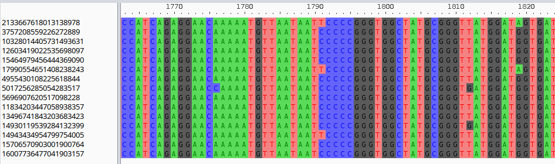

# exploring block alignments

In this next tutorial section we explore block alignments in more detail.

## extracting block alignments

Let's consider a core block from our graph:

```python
block_stats = graph.to_blockstats_df()
print(block_stats[block_stats.core])
# block_id              count  n_strains  duplicated  core   len        
# ...                                
# 1745536582941762917      15         15       False  True  2932
# ...
block = graph.blocks[1745536582941762917]
```

The block can be exported as a biopython alignment object:

```python
aln = block.to_biopython_alignment()
print(aln)
# Alignment with 15 rows and 2932 columns
# TTCTGCAATTGAGTCTTGTATGCCCCCATAACAGCACTAAATAA...GCT 2133667618013138978
# TTCTGTAATTGAGTCTTGTATGCCCCCATAACAGCACTAAATAA...GCT 3757208559226272889
# TTCTGTAATTGAGTCTTGTATGCCCCCATAACAGCACTAAATAA...GCT 4955430108225618844
# TTCTGCAATTGAGTCTTGTATGCCCCCATAACAGCACTAAATAA...GCT 5017256285054283517
# ...
```

This can be easily written to a file and visualized with a multiple sequence alignment viewer such as [aliview](https://ormbunkar.se/aliview/):
```python
# write alignment to file
from Bio import AlignIO
AlignIO.write(aln, "aln.fa", "fasta")
```



!!! note "block alignment vs block sequences"

    As explained in [Pangraph tutorial](TODO), insertions are not exported in alignments since they are not aligned to the consensus sequence of the block by pangraph.

    If these insertions are important for your analysis, you can instead export **unaligned but complete** block sequences as biopython SeqRecord objects with:
    
    ```python
    records = block.to_biopython_records()
    ```

    These can then be easily written to file with:
    
    ```python
    from Bio import SeqIO
    SeqIO.write(records, "seqs.fa", "fasta")
    ```

    and then aligned with a multiple sequence alignment tool such as [MAFFT](https://mafft.cbrc.jp/alignment/software/):

    ```bash
    mafft seqs.fa > aln.fa
    ```


## sequence divergence

- consensus frequency along the alignment
- pairwise sequence divergence

## core genome alignment

## core genome tree

