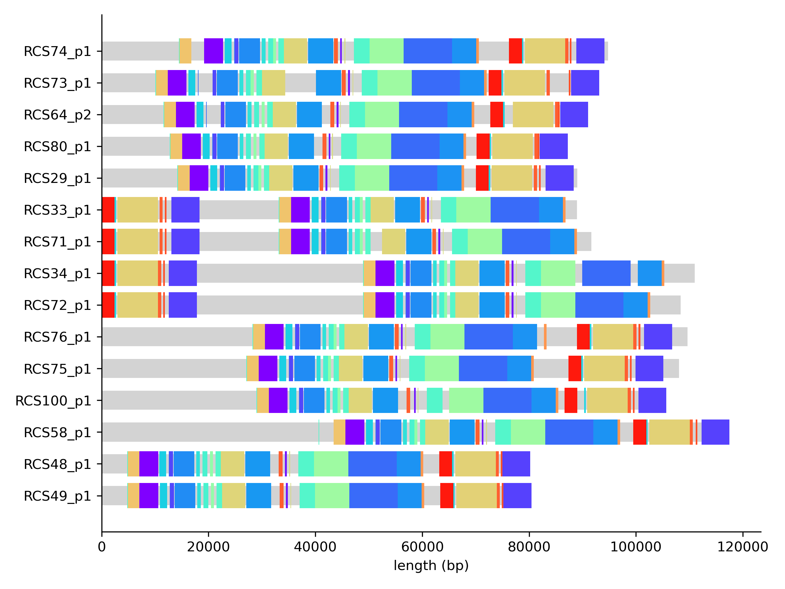
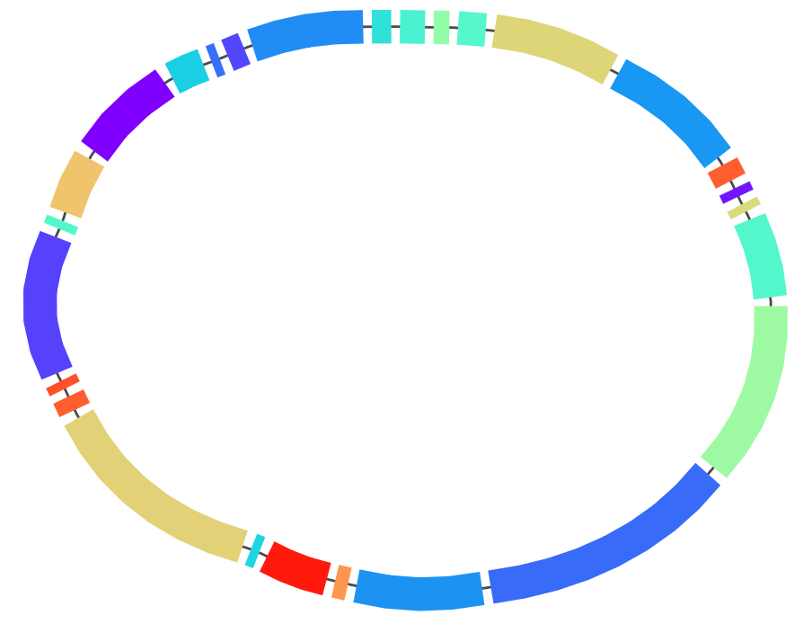

# paths and core genome synteny

In this tutorial we will learn how to visualize paths in a pangraph and to survey changes in core-genome synteny.

## visualizing paths

As discussed in the introduction, paths are representation of genomes as sequences of blocks. After loading a graph, we can export a simple representation of the graph with the `to_path_dictionary` method. This method returns a dictionary where each key is the name of a path and the value is a list of tuples. Each tuple contains the block id and the strand of the block in the path.

```python
import pypangraph as pp

graph = pp.Pangraph.from_json("plasmids.json")

path_dict = graph.to_path_dictionary()
print(path_dict)
# {
#   'RCS48_p1': [(14710008249239879492, True), (8000128254022432074, True), ... ],
#   'RCS80_p1': [(14710008249239879492, True), (8000128254022432074, True), ... ],
#   ...
# }
```

Combining this representation with information on block lengths and frequency, we can easily create simple visualizations for the paths. For example we can assign different random colors to core blocks and color all non-core blocks in gray.

```python
import matplotlib.pyplot as plt
import matplotlib as mpl
import numpy as np
from collections import defaultdict

block_stats = graph.to_blockstats_df()
# dictionary to assign a new random color to each block
block_color = defaultdict(lambda: plt.cm.rainbow(np.random.rand()))

fig, ax = plt.subplots(figsize=(8, 6))

y = 0
for path_name, path in path_dict.items():
    x = 0
    for block_id, block_strand in path:

        L = block_stats.loc[block_id, "len"] # block consensus length
        is_core = block_stats.loc[block_id, "core"]
        
        # block color
        color = block_color[block_id] if is_core else "lightgray"
        block_color[block_id] = mpl.colors.to_hex(color)

        height = 0.8 if is_core else 0.6 # block thickness
        
        ax.barh(y, L, left=x, height=height, color=color)
        
        x += L
    y += 1

ax.set_yticks(range(len(path_dict)))
ax.set_yticklabels(path_dict.keys())
ax.set_xlabel("length (bp)")
plt.show()
```



From this plot we observe a strong conservation in the order of core blocks. This is even more explicit if we look at the graph in [Bandage](https://rrwick.github.io/Bandage/). We can use the export function of pangraph to export the graph in GFA format. By adding the `--no-duplicated` flag and the `--minimum-depth 15` option we can make sure that only core blocks are exported.

```bash
pangraph export gfa --no-duplicated --minimum-depth 15 plasmids.json > plasmids_core.gfa
```

Moreover we can save the block colors that we used in the previous plot in a csv file, that can be loaded by Bandage to color the blocks.

```python
pd.Series(block_color, name="Colour").to_csv("block_colors.csv")
```

After loading the graph and coloring it we obtain the following picture:




This shows immediately that the order of core blocks is perfectly conserved in our dataset.

## core genome synteny


